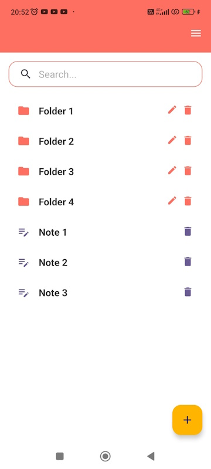

# QuickNotes

NoteApp is a handy Android note—taking app written in Kotlin. It allows you to create folders (including attachments) and notes, edit them, and use various text formatting functions.

## Content

- [Description](#description)
- [Functions](#functions)
- [Technology](#technology)
- [Installation](#installation)
- [Usage](#usage)
- [Screenshots](#screenshots)
- [Contacts](#contacts)

## Description

NoteApp is a note—taking application that allows users to create and organize their notes in folders. The application supports various text formatting functions and allows you to share notes in TXT and HTML format.

## Functions

- Create and edit notes
- Create and edit folders (including nested ones)
- Deleting notes and folders
- Text formatting:
  - Alignment on the right and left edges, in the center
  - Bold, italics, strikethrough, underlined text
  - Text background fill, text coloring
  - Adding/removing an indentation
  - Bulleted and numbered list
  - Removing formatting
- Inserting images
- Note viewing/editing mode
- Search and replace text
- Share a note in TXT and HTML format
- Move a note to another folder
- Theme change (dark/ light)
- Language change (Russian / English)

## Technology

- **Programming language:** Kotlin
- **Libraries:** richeditor-Android (by wasabeef)
- **Platform:** Android

## Installation

1. Download the APK file from [this link](app/release/app-release.apk).
2. Install the app on your Android device.
3. Open the app and start creating notes!

## Usage

1. **Create a note:**
 - Open the main screen.
 - Click on the "Create a note" button.
 - Enter the title and text of the note.
 - Click "Save".

2. **To create a folder:**
 - Open the main screen.
 - Click on the "Create Folder" button.
 - Enter the folder name.
 - Click "Save".

3. **Note Editing:**
 - Open the note.
 - Make changes and click "Save".

## Screenshots

## Contacts

If you have any questions or suggestions, please contact me.:

- **Email:** dev.assist@yandex.ru
- **GitHub:** [S0s0Combain](https://github.com/S0s0Combain)

## License

This project is licensed under the [MIT License](LICENSE).
